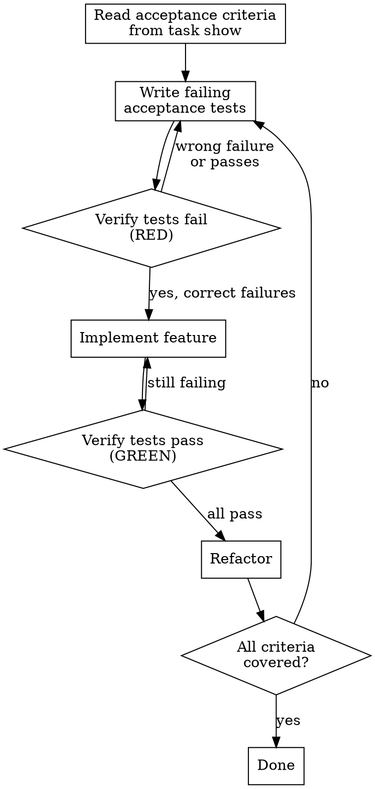

# Acceptance Test-Driven Development

Write executable acceptance tests from openspec task criteria BEFORE implementation. Acceptance criteria become the test suite; implementation makes them pass.

## When to Use

- Openspec task has acceptance criteria in `task show` output
- User asks for "ATDD", "acceptance tests first", "test the criteria"
- Bridging product requirements (PRD/openspec) to automated tests
- You want proof that acceptance criteria are met, not just "it works"

**Not for:** Unit-level TDD (use tdd skill). Exploratory testing. Tasks without acceptance criteria.

## The Cycle



## Step-by-Step

### 1. Extract acceptance criteria

```bash
agentic-agent task show TASK-ID --no-interactive
```

Look for the `Acceptance Criteria:` section. Each criterion becomes one or more test cases.

### 2. Translate criteria to test cases

Map each criterion to a concrete test:

| Acceptance Criterion | Test Case |
|---------------------|-----------|
| "tsconfig.json with strict mode" | Assert `compilerOptions.strict === true` in tsconfig.json |
| "No ESLint errors on existing code" | Run `npx eslint .` and assert exit code 0 |
| "Path aliases @/ for src/" | Assert `paths["@/*"]` exists in tsconfig.json |

### 3. Write tests BEFORE implementation

Write all acceptance tests. They MUST fail — if any passes, the criterion was already met or the test is wrong.

```
RED: Every acceptance test fails for the right reason (missing feature, not syntax error)
```

### 4. Implement to make tests pass

Write the minimum code to make acceptance tests pass. No extra features.

```
GREEN: All acceptance tests pass. Nothing more.
```

### 5. Refactor

Improve code quality. Run tests after every change. All must stay green.

### 6. Verify coverage

Every acceptance criterion from `task show` must have at least one passing test. If a criterion has no test, go back to step 2.

## Critical Rules

| Rule | Why |
|------|-----|
| **One test per criterion minimum** | Untested criteria are unverified claims |
| **Tests fail first** | A test that never failed proves nothing |
| **Criteria from task show, not invented** | Tests must verify what was promised |
| **No implementation before tests** | ATDD = tests drive the implementation |
| **Run tests after every change** | Catch regressions immediately |

## Combining with Other Skills

**ATDD + TDD:** ATDD covers acceptance-level (feature works). TDD covers unit-level (functions work). Use both: ATDD first for the big picture, TDD for implementation details.

**ATDD + run-with-ralph:** Build ATDD tests into the ralph prompt's verification step. Ralph runs `npm test` each iteration and checks acceptance criteria.

**ATDD + openspec:** Openspec provides the criteria. ATDD makes them executable. The loop: openspec defines → ATDD verifies → implementation satisfies.

## Common Mistakes

| Mistake | Fix |
|---------|-----|
| Writing tests after implementation | Tests must fail first — delete code, start over |
| Inventing criteria not in task show | Test what was specified, not what you think is needed |
| Testing implementation details | Test observable behavior matching the criterion |
| Skipping criteria that "seem obvious" | Every criterion gets a test. No exceptions. |
| Tests that pass on first run | Either criterion already met (skip it) or test is wrong |

## Quick Example

Given task with acceptance criteria:
```
- User can log in with email and password
- Invalid credentials show error message
- Session persists across page refreshes
```

Write tests first:
```typescript
test('user can log in with valid credentials', async () => {
  const result = await login('user@test.com', 'password123');
  expect(result.success).toBe(true);
  expect(result.token).toBeDefined();
});

test('invalid credentials show error', async () => {
  const result = await login('user@test.com', 'wrong');
  expect(result.success).toBe(false);
  expect(result.error).toContain('Invalid credentials');
});

test('session persists across refreshes', async () => {
  await login('user@test.com', 'password123');
  const session = await getSession();
  expect(session.authenticated).toBe(true);
});
```

All three fail (RED). Now implement login. All three pass (GREEN). Refactor.
