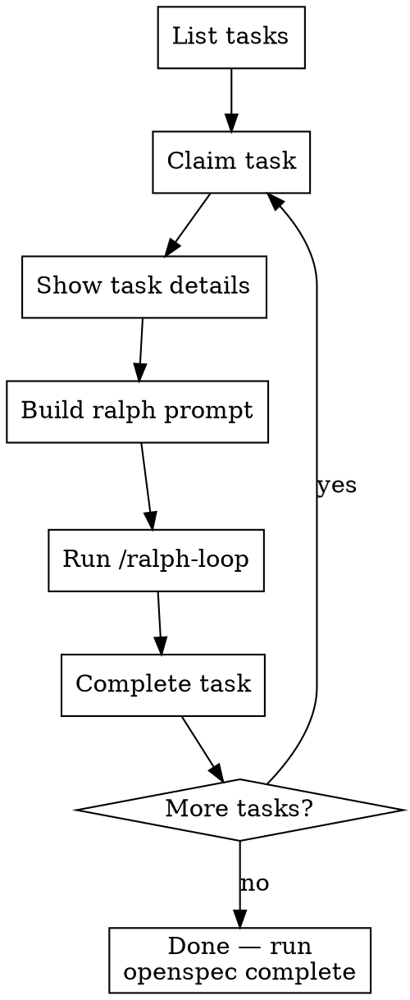

# Run with Ralph

Execute openspec tasks using Ralph Wiggum iterative loops. One task per loop, acceptance criteria as the completion signal.

## When to Use

- Openspec tasks exist in backlog and you want iterative implementation
- User asks to "ralph my tasks", "run with ralph", "iterate on tasks"
- You need automated convergence: Ralph reads specs, checks criteria, loops until done

**Not for:** Planning (use openspec). Manual one-shot implementation. Tasks without acceptance criteria.

## The Loop



## Step-by-Step

### 1. List and pick a task

```bash
agentic-agent task list --no-interactive
```

### 2. Claim it (BEFORE ralph)

```bash
agentic-agent task claim TASK-ID
```

This records your git branch and timestamp. **Never skip this** — without it, `task complete` can't capture commits.

### 3. Get task details

```bash
agentic-agent task show TASK-ID --no-interactive
```

Extract from the output:
- **Spec Refs** — files Ralph must read each iteration
- **Acceptance Criteria** — Ralph's convergence conditions
- **Technical Notes** — implementation hints

### 4. Build the ralph prompt

Use this template — fill in from `task show` output:

```
You are implementing TASK-ID: TASK TITLE.

## Context — read these files first:
- SPEC_REF_1
- SPEC_REF_2
- .agentic/context/tech-stack.md

## Acceptance Criteria — ALL must pass:
- CRITERION_1
- CRITERION_2
- CRITERION_3

## On each iteration:
1. Read the task detail file for technical notes
2. Implement what's missing
3. Run verification commands (tests, linter, build)
4. If ALL criteria pass, output <promise>TASK COMPLETE</promise>
```

### 5. Launch ralph

```
/ralph-loop "YOUR PROMPT" --max-iterations 10 --completion-promise "TASK COMPLETE"
```

### 6. Complete the task

```bash
agentic-agent task complete TASK-ID
agentic-agent openspec status CHANGE-ID
```

### 7. Repeat for next task

Go back to step 1. One task per ralph loop.

## Critical Rules

| Rule | Why |
|------|-----|
| **One task per loop** | Multiple tasks = no convergence signal |
| **Always claim before ralph** | Git tracking needs the timestamp |
| **Always include spec refs in prompt** | Ralph loses context between iterations |
| **Always include `<promise>` tag instruction** | Without it, Ralph loops forever |
| **Always set `--max-iterations`** | Safety net — 5-15 depending on complexity |
| **Always `task complete` after** | Captures commits, updates openspec progress |

## Common Mistakes

| Mistake | Fix |
|---------|-----|
| Launching ralph without claiming | `task claim` FIRST — git tracking needs it |
| Vague prompt without acceptance criteria | Copy criteria verbatim from `task show` |
| No spec refs in prompt | Ralph needs context each iteration — include file paths |
| Missing `<promise>` tag in prompt | Add explicit instruction: "output `<promise>TASK COMPLETE</promise>`" |
| Multiple tasks in one loop | One task = one loop. Always. |
| Forgetting `task complete` | Run it right after ralph finishes |
| No `--max-iterations` | Always set a cap. 10 is a good default. |

## Quick Example

```bash
# 1. Claim
agentic-agent task claim TASK-936281-2

# 2. Show (read the output)
agentic-agent task show TASK-936281-2 --no-interactive

# 3. Ralph
/ralph-loop "Implement TASK-936281-2: Configure TypeScript and ESLint.

Read first:
- .agentic/openspec/changes/todo-pwa/tasks/02-typescript-eslint.md
- .agentic/openspec/changes/todo-pwa/proposal.md
- .agentic/context/tech-stack.md

Acceptance:
- tsconfig.json with strict mode
- ESLint configured for React + TypeScript
- No ESLint errors
- Path aliases @/ for src/

Run npx tsc --noEmit && npx eslint . to verify.
When all pass: <promise>TASK COMPLETE</promise>" --max-iterations 10 --completion-promise "TASK COMPLETE"

# 4. Complete
agentic-agent task complete TASK-936281-2
agentic-agent openspec status todo-pwa
```
