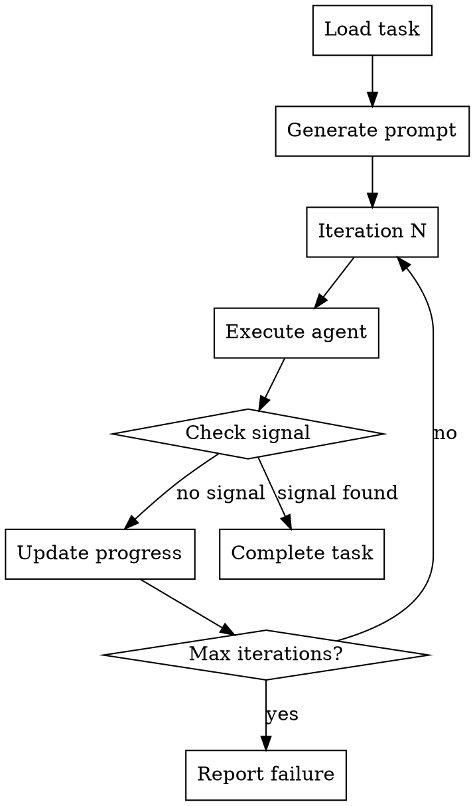

# CLI Ralph Loop Design

## Problem Statement

Currently, `/ralph-loop` only exists as a command in AI chat interfaces (Claude.ai, etc.). There's no way to execute a Ralph Wiggum iterative loop from the terminal using `agentic-agent` CLI.

**User need:** Execute ralph-loop methodology from terminal for:
- Scripting and automation
- CI/CD pipelines
- Non-interactive environments
- When working without AI chat access

## Current Workarounds

### 1. Autopilot (exists)
```bash
agentic-agent autopilot start --max-iterations 5
```

**Limitations:**
- Not iterative convergence loop
- Processes tasks linearly, not iteratively
- No promise/completion signal
- No refinement iterations on same task

### 2. Run command (exists)
```bash
agentic-agent run
```

**Limitations:**
- Single execution cycle
- No iteration loop
- No convergence checking

## Solution: CLI Ralph Loop

Add `agentic-agent ralph` command that implements Ralph Wiggum methodology from terminal.

### Design

```
agentic-agent ralph <TASK_ID> [flags]

Flags:
  --max-iterations int       Maximum iterations (default 10)
  --completion-signal string Signal to detect completion (default "TASK COMPLETE")
  --agent string            AI agent to use (claude-code, cursor, copilot, etc.)
  --prompt-file string      File containing iteration prompt template
  --auto                    Auto-generate prompt from task details
```

### Architecture

```
┌─────────────────────────────────────────────────────────────┐
│                    CLI Ralph Loop                            │
├─────────────────────────────────────────────────────────────┤
│                                                               │
│  1. Load task details (specs, acceptance, scope)            │
│  2. Generate/load iteration prompt                           │
│  3. For each iteration (1 to max):                          │
│     ├─ Execute agent with prompt + context                  │
│     ├─ Capture output                                        │
│     ├─ Check for completion signal                          │
│     ├─ Update progress                                       │
│     └─ If signal detected → complete and exit               │
│  4. After loop: complete task or report failure             │
│                                                               │
└─────────────────────────────────────────────────────────────┘
```

### Flow



## Implementation

### Command Structure

```go
// cmd/agentic-agent/ralph.go

var ralphCmd = &cobra.Command{
    Use:   "ralph TASK_ID",
    Short: "Execute task using Ralph Wiggum iterative loop",
    Long: `Execute a task using Ralph Wiggum methodology: iterate until
completion signal is detected or max iterations reached.

The loop executes an AI agent repeatedly, checking for convergence
after each iteration. When the agent outputs the completion signal,
the task is marked complete and the loop exits.

Examples:
  # Auto-generate prompt and execute with Claude Code
  agentic-agent ralph TASK-123 --auto --agent claude-code

  # Use custom prompt template
  agentic-agent ralph TASK-123 --prompt-file ralph-prompt.md

  # Set max iterations and custom signal
  agentic-agent ralph TASK-123 --max-iterations 15 --completion-signal "DONE"
`,
    Args: cobra.ExactArgs(1),
    Run: func(cmd *cobra.Command, args []string) {
        taskID := args[0]

        maxIterations, _ := cmd.Flags().GetInt("max-iterations")
        completionSignal, _ := cmd.Flags().GetString("completion-signal")
        agent, _ := cmd.Flags().GetString("agent")
        promptFile, _ := cmd.Flags().GetString("prompt-file")
        auto, _ := cmd.Flags().GetBool("auto")

        runRalphLoop(taskID, maxIterations, completionSignal, agent, promptFile, auto)
    },
}

func runRalphLoop(taskID string, maxIter int, signal, agent, promptFile string, auto bool) {
    // 1. Load task
    tm := tasks.NewTaskManager(".agentic/tasks")
    task, source, err := tm.FindTask(taskID)
    if err != nil {
        fmt.Printf("Error: %v\n", err)
        os.Exit(1)
    }

    if source != "in-progress" {
        fmt.Printf("Error: Task must be in-progress. Current status: %s\n", source)
        fmt.Printf("Run: agentic-agent task claim %s\n", taskID)
        os.Exit(1)
    }

    // 2. Generate or load prompt
    var prompt string
    if auto {
        prompt = generatePromptFromTask(task)
    } else if promptFile != "" {
        data, err := os.ReadFile(promptFile)
        if err != nil {
            fmt.Printf("Error reading prompt file: %v\n", err)
            os.Exit(1)
        }
        prompt = string(data)
    } else {
        fmt.Println("Error: Must specify --auto or --prompt-file")
        os.Exit(1)
    }

    // 3. Detect agent if not specified
    if agent == "" {
        detected := skills.DetectAgent()
        agent = detected.Name
        fmt.Printf("Auto-detected agent: %s\n", agent)
    }

    // 4. Execute loop
    fmt.Printf("Starting Ralph loop for %s\n", taskID)
    fmt.Printf("Agent: %s\n", agent)
    fmt.Printf("Max iterations: %d\n", maxIter)
    fmt.Printf("Completion signal: %s\n\n", signal)

    for i := 1; i <= maxIter; i++ {
        fmt.Printf("─── Iteration %d/%d ───\n", i, maxIter)

        // Execute agent
        output, err := executeAgentIteration(agent, prompt, task, i)
        if err != nil {
            fmt.Printf("Error in iteration %d: %v\n", i, err)
            continue
        }

        // Check for completion signal
        if strings.Contains(output, signal) {
            fmt.Printf("\n✓ Completion signal detected!\n")
            fmt.Printf("Output: %s\n\n", output)

            // Complete task
            if err := tm.CompleteTask(taskID); err != nil {
                fmt.Printf("Error completing task: %v\n", err)
                os.Exit(1)
            }

            fmt.Printf("✓ Task %s completed successfully\n", taskID)
            return
        }

        // Update progress
        fmt.Printf("Iteration %d complete. No completion signal yet.\n\n", i)
        time.Sleep(2 * time.Second) // Brief pause between iterations
    }

    // Max iterations reached without completion
    fmt.Printf("⚠ Max iterations (%d) reached without completion signal\n", maxIter)
    fmt.Printf("Task %s remains in-progress\n", taskID)
    os.Exit(1)
}

func generatePromptFromTask(task *models.Task) string {
    var b strings.Builder

    b.WriteString(fmt.Sprintf("You are implementing %s: %s\n\n", task.ID, task.Title))

    if task.Description != "" {
        b.WriteString("## Description\n")
        b.WriteString(task.Description)
        b.WriteString("\n\n")
    }

    if len(task.SpecRefs) > 0 {
        b.WriteString("## Context — read these files first:\n")
        for _, ref := range task.SpecRefs {
            // Resolve spec to full path
            resolver := specs.NewResolver(getConfig())
            resolved := resolver.ResolveSpec(ref)
            if resolved.Found {
                b.WriteString(fmt.Sprintf("- %s\n", resolved.Path))
            }
        }
        b.WriteString("\n")
    }

    if len(task.Acceptance) > 0 {
        b.WriteString("## Acceptance Criteria — ALL must pass:\n")
        for _, criterion := range task.Acceptance {
            b.WriteString(fmt.Sprintf("- %s\n", criterion))
        }
        b.WriteString("\n")
    }

    if len(task.Scope) > 0 {
        b.WriteString("## Scope (directories to modify):\n")
        for _, dir := range task.Scope {
            b.WriteString(fmt.Sprintf("- %s\n", dir))
        }
        b.WriteString("\n")
    }

    b.WriteString("## On each iteration:\n")
    b.WriteString("1. Review the specs and acceptance criteria\n")
    b.WriteString("2. Implement what's missing\n")
    b.WriteString("3. Run verification commands (tests, linters, etc.)\n")
    b.WriteString("4. If ALL acceptance criteria pass, output: TASK COMPLETE\n")

    return b.String()
}

func executeAgentIteration(agent, prompt string, task *models.Task, iteration int) (string, error) {
    // Build context bundle for this iteration
    bundle := buildIterationContext(task, prompt, iteration)

    // Execute based on agent type
    switch agent {
    case "claude-code":
        return executeClaudeCode(bundle)
    case "cursor":
        return executeCursor(bundle)
    case "copilot":
        return executeCopilot(bundle)
    default:
        return "", fmt.Errorf("unsupported agent: %s", agent)
    }
}

func executeClaudeCode(bundle string) (string, error) {
    // Write bundle to temp file
    tmpFile := ".agentic/ralph-iteration.md"
    if err := os.WriteFile(tmpFile, []byte(bundle), 0644); err != nil {
        return "", err
    }

    // Execute via claude CLI (if available) or via API
    // For MVP, we can use simple prompt file approach
    fmt.Printf("📄 Iteration context written to: %s\n", tmpFile)
    fmt.Println("🤖 Executing Claude Code...")

    // Option A: Use Claude CLI
    cmd := exec.Command("claude", "chat", "--file", tmpFile)
    output, err := cmd.CombinedOutput()

    return string(output), err
}

func buildIterationContext(task *models.Task, prompt string, iteration int) string {
    var b strings.Builder

    b.WriteString(fmt.Sprintf("# Ralph Loop Iteration %d\n\n", iteration))
    b.WriteString(prompt)
    b.WriteString("\n\n")

    b.WriteString("## Previous Iterations\n")
    // Load and include relevant context from previous iterations
    // (This would read from session state or progress files)

    return b.String()
}

func init() {
    ralphCmd.Flags().Int("max-iterations", 10, "Maximum iterations")
    ralphCmd.Flags().String("completion-signal", "TASK COMPLETE", "Completion signal to detect")
    ralphCmd.Flags().String("agent", "", "AI agent to use (auto-detect if empty)")
    ralphCmd.Flags().String("prompt-file", "", "File containing iteration prompt")
    ralphCmd.Flags().Bool("auto", false, "Auto-generate prompt from task")

    rootCmd.AddCommand(ralphCmd)
}
```

## Usage Examples

### Example 1: Auto Mode with Claude Code

```bash
# 1. Claim task first
agentic-agent task claim TASK-123

# 2. Execute ralph loop (auto-generates prompt)
agentic-agent ralph TASK-123 --auto --agent claude-code

# Output:
Starting Ralph loop for TASK-123
Agent: claude-code
Max iterations: 10
Completion signal: TASK COMPLETE

─── Iteration 1/10 ───
📄 Iteration context written to: .agentic/ralph-iteration.md
🤖 Executing Claude Code...
[Claude executes, writes code, runs tests]
Iteration 1 complete. No completion signal yet.

─── Iteration 2/10 ───
[...]

─── Iteration 5/10 ───
[Claude runs final tests]
✓ Completion signal detected!
Output: All tests pass. TASK COMPLETE

✓ Task TASK-123 completed successfully
```

### Example 2: Custom Prompt File

```bash
# Create custom prompt
cat > ralph-prompt.md <<EOF
Implement TASK-123: User Authentication

Read specs:
- .agentic/spec/auth/requirements.md
- .agentic/spec/auth/api-design.md

Acceptance:
- JWT tokens generated correctly
- Login endpoint returns 200 with valid creds
- Tests pass

On each iteration:
1. Read specs
2. Implement missing pieces
3. Run: npm test
4. If all pass: output "AUTH COMPLETE"
EOF

# Execute with custom prompt
agentic-agent ralph TASK-123 \
  --prompt-file ralph-prompt.md \
  --completion-signal "AUTH COMPLETE" \
  --max-iterations 15
```

### Example 3: CI/CD Pipeline

```bash
#!/bin/bash
# ci-ralph-loop.sh

set -e

# Claim task
agentic-agent task claim $TASK_ID

# Execute ralph loop
if agentic-agent ralph $TASK_ID --auto --max-iterations 20; then
  echo "✓ Task completed successfully"

  # Run final validation
  agentic-agent validate

  # Create PR
  agentic-agent task complete $TASK_ID
  gh pr create --title "Complete $TASK_ID"
else
  echo "✗ Ralph loop failed"
  exit 1
fi
```

## Agent Execution Strategies

### Strategy 1: CLI Integration (if agent has CLI)

```go
func executeClaudeCode(bundle string) (string, error) {
    tmpFile := ".agentic/ralph-iteration.md"
    os.WriteFile(tmpFile, []byte(bundle), 0644)

    cmd := exec.Command("claude", "chat", "--file", tmpFile)
    output, err := cmd.CombinedOutput()

    return string(output), err
}
```

### Strategy 2: API Integration

```go
func executeClaudeCodeAPI(bundle string) (string, error) {
    client := anthropic.NewClient(os.Getenv("ANTHROPIC_API_KEY"))

    resp, err := client.CreateMessage(context.Background(), &anthropic.MessageRequest{
        Model: "claude-sonnet-4",
        Messages: []anthropic.Message{
            {Role: "user", Content: bundle},
        },
    })

    return resp.Content[0].Text, err
}
```

### Strategy 3: Interactive Mode (human-in-loop)

```go
func executeInteractive(bundle string) (string, error) {
    // Write bundle to file
    tmpFile := ".agentic/ralph-iteration.md"
    os.WriteFile(tmpFile, []byte(bundle), 0644)

    // Open in editor for human to respond
    editor := os.Getenv("EDITOR")
    if editor == "" {
        editor = "vim"
    }

    cmd := exec.Command(editor, tmpFile)
    cmd.Stdin = os.Stdin
    cmd.Stdout = os.Stdout
    cmd.Stderr = os.Stderr

    if err := cmd.Run(); err != nil {
        return "", err
    }

    // Read response
    response, err := os.ReadFile(tmpFile)
    return string(response), err
}
```

## Alternative: Wrapper Script for Chat AI

If full CLI integration is complex, provide a wrapper that bridges terminal and chat:

```bash
#!/bin/bash
# agentic-ralph.sh - Terminal wrapper for chat AI ralph loops

TASK_ID=$1
MAX_ITER=${2:-10}

# Claim task
agentic-agent task claim $TASK_ID

# Generate prompt
PROMPT=$(agentic-agent task show $TASK_ID --format ralph-prompt)

# Output instructions
cat <<EOF
──────────────────────────────────────────────────
Copy this prompt to Claude.ai and run /ralph-loop:

$PROMPT

After ralph-loop completes, return here and run:
  agentic-agent task complete $TASK_ID
──────────────────────────────────────────────────
EOF

# Wait for user confirmation
read -p "Press Enter after ralph-loop completes in Claude.ai..."

# Complete task
agentic-agent task complete $TASK_ID
```

## Benefits

**CLI Ralph Loop:**
✅ Scriptable and automatable
✅ Works in CI/CD pipelines
✅ No need for web browser
✅ Consistent with other agentic-agent commands

**Wrapper Script:**
✅ Simple to implement
✅ Works immediately with existing chat AI
✅ No complex agent integration needed

## Implementation Phases

### Phase 1: Wrapper Script (Quick Win)
- [ ] Create `agentic-ralph.sh` wrapper
- [ ] Add `--format ralph-prompt` to task show
- [ ] Document workflow

### Phase 2: Basic CLI Integration
- [ ] Add `ralph` command to CLI
- [ ] Implement auto-prompt generation
- [ ] Support interactive mode

### Phase 3: Agent Integration
- [ ] Claude Code API integration
- [ ] Cursor integration
- [ ] Copilot integration

### Phase 4: Advanced Features
- [ ] Token tracking during loop
- [ ] Auto-checkpoint on iteration N
- [ ] Progress visualization
- [ ] Multi-task ralph loops

## Open Questions

1. **How to handle interactive agent responses?**
   - Wait for completion before next iteration?
   - Stream output in real-time?

2. **Should ralph loop support multiple tasks?**
   - One task per loop (current design)
   - Multiple tasks sequentially
   - Parallel task execution

3. **How to persist iteration state?**
   - In-memory only
   - Write to `.agentic/ralph-state.json`
   - Use session tracking

4. **Token limits during long loops?**
   - Auto-checkpoint at threshold
   - Warn and continue
   - Pause for user input

## Summary

Two paths forward:

**Option A: Full CLI Implementation**
- `agentic-agent ralph TASK-ID --auto`
- Executes agent via CLI/API
- Manages iteration loop
- Detects completion signal

**Option B: Wrapper Script (faster)**
- `agentic-ralph.sh TASK-ID`
- Generates prompt
- Human copies to chat AI
- Returns to complete task

**Recommendation:** Start with Option B (wrapper) for immediate value, then build toward Option A as agent integrations mature.
